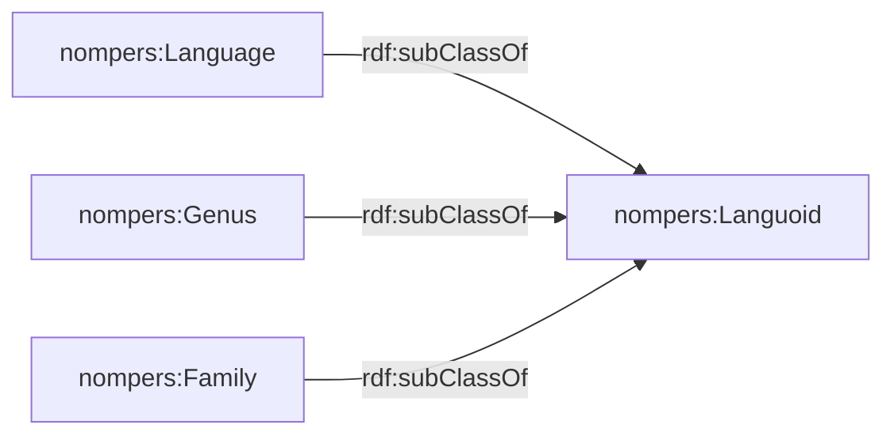

# Crosslinguistic Ontology of Nominal Person (NomPersOnt)

*Work in progress – early experimental version*

---

# Overview

The **Crosslinguistic Nominal Person Ontology (NomPersOnt)** is an OWL ontology designed to represent crosslinguistic knowledge about **nominal person marking** in human languages.

The ontology supports typological research on constructions such as:

> *we linguists*, *you students*, etc.

and syntactic variation observed on related constructions across human languages.

The ontology provides a structured semantic model for integrating and querying data from the **Crosslinguistic dataset on nominal person** ([Höhn 2025](https://zenodo.org/records/16605840)), building on insights from previous research ([Höhn (2017)](https://ling.auf.net/lingbuzz/003618), [Höhn (2020)](https://doi.org/10.5281/gjgl.1121), [Höhn (2024)](https://doi.org/10.1515/lingty-2023-0080)).
It is intended to support:

- integration of linguistic typological datasets
- reasoning over typological patterns
- triple-store based exploration of the dataset
- downstream use in computational systems such as RAG pipelines.

---

# Domain

The ontology models knowledge about:

- human languages
- genealogical classification
- geographical distribution
- typological parameters
- parameter values
- example constructions
- bibliographic sources

The focus is on linguistic properties of **nominal person constructions** (`CoreParameter`), but the ontology also includes **control parameters** (`ControlParameter`) such as word order that allow cross-typological comparison. This distinction is modelled for convenience and does not imply

This repository contains the formal definition of the Crosslinguistic Ontology of Nominal Person (NomPersCLONT), an OWL ontology designed to capture knowledge about nominal person marking in human languages. It supports a crosslinguistic typology focusing on word order and person-number restrictions, facilitating structured reasoning and integration with Retrieval-Augmented Generation (RAG) systems.  The ontology is based on the [Crosslinguistic dataset on nominal person](https://doi.org/10.5281/zeno) 

## Aims

- Create a knowledge model for a crosslinguistic typology focusing on word order and person-number restrictions in adnominal person marking to allow structured reasoning over the domain.
- The knowledge model should be compatible with the [Crosslinguistic dataset on nominal person](https://doi.org/10.5281/zeno).

## Domain of Interest

- Human languages
- Their (basic) genealogical, geographic, and syntactic properties
- Nominal person marking (e.g., English *we linguists*) (cf. [Höhn (2017)](https://ling.auf.net/lingbuzz/003618))


---

# Core Design Pattern

The ontology reifies typological observations as n-ary relations using the class **ParameterAssociation** which links instances of the classes:

- [`Languoid`](#languoid-layer)
- [`Parameter`](#typological-layer)
- [`ParameterValue`](#typological-layer)
- [`Source`](#source-layer)
- [`Example`](#example-layer) (optional)


This pattern allows the modelling of divergent claims regarding the same languoid, associated with relevant sources and potentially examples.

- multiple values per parameter (e.g. in case of divergent claims)
- the association of sources to specific claims 
- extensible typological annotations

---

# Main Classes

## Languoid Layer



For a simplified representation of genealogical relations, the ontology reifies three subtypes of languoids: languages, genera and families. (A recursive hierarchy of variable depth could be implemented for a more realistic model, but for the target dataset that seems to be overkill at this point.) 


### Properties of nompers:Languoid

- [glottocode](https://glottolog.org/)
- isTerminal


### nompers:Language

These datatype properties are associated with terminal-level languoids:

- [WALS](https://wals.info) ID
- [ISO 639-3](https://iso639-3.sil.org/code_tables/639/data) code
- geographic coordinates, modelled using `geo:Point`

---

## Typological Layer

```
nompers:Parameter
nompers:ParameterValue
nompers:ParameterAssociation
```

Parameters represent typological features, for example:

- word order
- genitive order
- adposition order
- properties of nominal person constructions.

Parameter values represent possible feature states.

Both are implemented as **SKOS concepts**.

---

## Example Layer

The ontology optionally models linguistic examples:

```
nompers:Example
```

Examples may include:

- primary text
- morphological analysis
- gloss
- translation
- language association (`inLanguage`)

---

## Source Layer

```
nompers:Source
```

Sources store bibliographic information for typological observations.

---

# External Vocabularies

The ontology reuses several established vocabularies:

- **SKOS** for concept representation
- **WGS84 Geo** for geographic coordinates
- **Dublin Core Terms** for metadata

---

# Repository Structure

```
nompers.ttl
    Main ontology definition

scripts/
    Experimental scripts for visualization with Mermaid
```

---

# Using the Ontology

## Loading

The ontology can be loaded into tools such as:

- Protégé
- Apache Jena
- RDFLib
- GraphDB
- Blazegraph

Example using RDFLib:

```python
from rdflib import Graph
g = Graph()
g.parse("nompers.ttl")
```

---

## Triple Store Integration

The intended workflow is:

```
CLDF dataset
   ↓
ETL conversion
   ↓
RDF triples using NomPers ontology
   ↓
Triple store
```

A separate repository will provide the ETL pipeline converting the CLDF dataset into RDF using this ontology.

---

# Example Query

Example SPARQL query retrieving languages with a given parameter value:

```
SELECT ?language
WHERE {
  ?assoc a nompers:ParameterAssociation .
  ?assoc nompers:relatesParameter ?parameter .
  ?assoc nompers:relatesParameterValue ?value .
  ?assoc nompers:relatesLanguoid ?language .
}
```

---

# Versioning

Versioning follows **semantic versioning**.

Current version:

```
0.0.1
```

This version is experimental and should not be considered stable yet.


---

# Citation

If you use this ontology in research, please cite:

Höhn, Georg F.K. 2026. **Nominal Person Ontology (NomPersOnt)**. (Zenodo DOI forthcoming)

---

# Related Resources

Crosslinguistic dataset on nominal person:

https://zenodo.org/records/16605840

Research background:

- [Höhn (2017)](https://ling.auf.net/lingbuzz/003618)
- [Höhn (2020)](https://doi.org/10.5281/gjgl.1121)
- [Höhn (2024)](https://doi.org/10.1515/lingty-2023-0080)

---

# License

CC-BY 4.0


